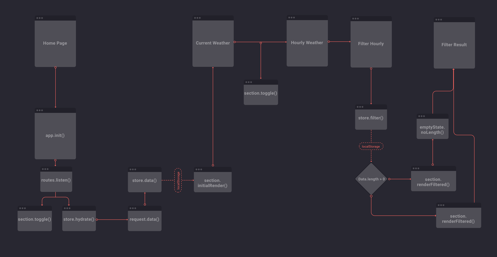

## Week 3
In the third week we will have the following exercises:
- [x] Give feedback to users
- [x] README with features, usage, wishlist and sources
- [x] Flow Diagram
- [x] Interaction Diagram
- [x] Filter, map, sort
- [x] Refactor
- [ ] PubSub pattern (extra)
- [x] Code review

### Deploying
Get an API key at [weather underground](https://www.wunderground.com) and put this in `config.js`.
```
touch config.js && vim config.js

var config = {
  API_KEY: ${YOUR_API_KEY}
};
```
Import this file in your html before the `main.js` file.

### Actor diagram of the app


### Flow diagram of the app


### Reviews
- https://github.com/olli208/web-app-from-scratch/issues/14
- https://github.com/olli208/web-app-from-scratch/issues/13
- https://github.com/Sjoerdbeentjes/minor-web-app-from-scratch/issues/22
- https://github.com/Sjoerdbeentjes/minor-web-app-from-scratch/issues/21
